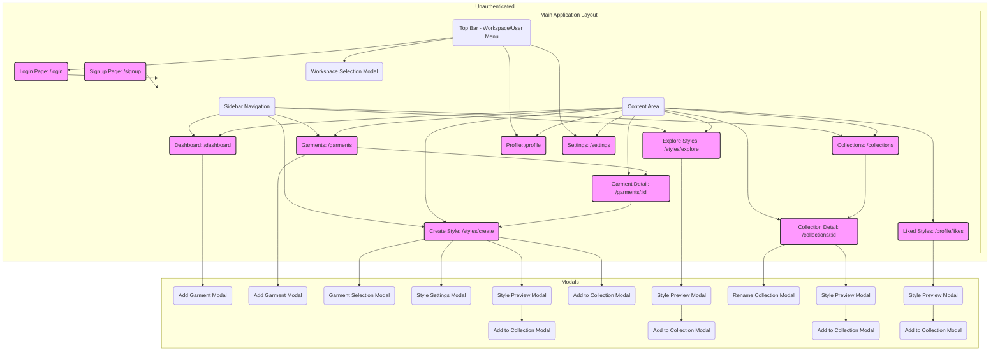

# AI Fashion App - Web Frontend Flow (React JS / Chakra UI)

*Version 1.0 – [Current Date] - Based on PRD v1.0*

---

## 1. Overview & Technology

This document describes the user interface flow for the AI Fashion App web application.

*   **Framework:** React JS (using `.js` files, **not** TSX/JSX explicitly requested)
*   **UI Library:** Chakra UI
*   **Routing:** `react-router-dom`
*   **State Management:** TBD (e.g., Zustand, Redux Toolkit)
*   **Backend Interaction:** Via `axios` (or `fetch`) calling the existing, unchanged backend API (see `frontend_api_reference_fashion.md` for mapping).

---

## 2. High-Level Navigation & Layout

*   **Main Layout (`AppLayout.js`):** A persistent layout likely containing:
    *   A **Sidebar** (using `Box` or `VStack` with links) for primary navigation: Dashboard, Garments, Create Style, Explore Styles, Collections.
    *   A **Top Bar** (using `Flex` or `HStack`) showing the current Workspace, User menu (Profile, Settings, Logout), and potentially Credit Balance.
    *   The main **Content Area** where the routed page component is rendered.
*   **Routing:** Handled by `react-router-dom` mapping URL paths to page components.
*   **Authentication:** Routes like `/dashboard`, `/garments`, etc., will be protected, redirecting to `/login` if the user is not authenticated.

---

## 3. Page-by-Page Description (React Components using Chakra UI)

### 3.1 Login / Signup (`LoginPage.js`, `SignupPage.js`)
| Component | Chakra UI Elements | Actions | API Calls |
|---|---|---|---|
| Login Form | `VStack`, `FormControl`, `FormLabel`, `Input` (Email, Password), `Button` | Submit form | `POST /api/auth/login` |
| Signup Form | `VStack`, `FormControl`, `FormLabel`, `Input` (Email, Password, Name?), `Button` | Submit form | `POST /api/auth/signup` |
| Links | `Link` (Chakra or React Router) | Navigate between Login/Signup | N/A |

### 3.2 Dashboard (`DashboardPage.js`)
| Section | Component | Chakra UI Elements | Actions | API Calls |
|---|---|---|---|---|
| Header | `WorkspaceSelector.js` (in Top Bar) | `Menu`, `MenuButton`, `MenuList`, `MenuItem` | Select Workspace | `GET /api/workspaces` |
| Recent Garments | `GarmentCarousel.js` or `GarmentGrid.js` | `Heading`, `SimpleGrid`/Carousel Lib, `GarmentCard.js`, `Button` ("See All") | Click Card -> `/garments/:id`; Click "See All" -> `/garments` | `GET /api/products?workspaceId=...&limit=X` |
| "Add Garment" Prompt | `AddGarmentCard.js` | `Card`, `Button` | Click Button -> Opens `AddGarmentModal` | N/A |
| Recent Styles | `StyleGrid.js` | `Heading`, `SimpleGrid`, `StyleCard.js`, `Button` ("See All") | Click Card -> Opens `StylePreviewModal`; Click "See All" -> `/styles/all` (or similar) | `GET /api/assets?workspaceId=...&limit=Y&sort=recent` |

### 3.3 Garments (`GarmentListPage.js`, `GarmentDetailPage.js`)
| Page/Component | Chakra UI Elements | Actions | API Calls |
|---|---|---|---|
| `GarmentListPage` | `Heading`, `Button` ("Add Garment"), `Input` (Search by Name?), `SimpleGrid`, `GarmentCard.js` | Click Add -> Opens `AddGarmentModal`; Click Card -> `/garments/:id`; Search filters list (client-side) | `GET /api/products?workspaceId=...` |
| `GarmentCard.js` | `Card`, `Image`, `Heading` (Name), `Button` ("Use for Style") | Click "Use" -> Navigates to `/styles/create` with Garment pre-selected | N/A |
| `GarmentDetailPage` | `Image`, `Heading` (Name), `Button` ("Generate Style with this Garment") | Click Button -> Navigates to `/styles/create` with Garment pre-selected | `GET /api/products/:id` |
| `AddGarmentModal.js` | `Modal`, `ModalOverlay`, `ModalContent`, `ModalHeader`, `ModalBody`, `FormControl`, `Input` (Name), `Input` (Image URL), `Button` ("Save") | Submit form | `POST /api/products` |

### 3.4 Create Style (`CreateStylePage.js`)
| Section | Component | Chakra UI Elements | Actions | API Calls |
|---|---|---|---|---|
| Mode Selection | `ModeSelector.js` | `RadioGroup`, `Radio` (Text Only, Use Garment, Upload Image) | Change state | N/A |
| Garment Selection (Mode: Use Garment) | `SelectedGarmentDisplay.js` | `Card`, `Image`, `Text`, `Button` ("Change") | Click Change -> Opens `GarmentSelectionModal` | N/A |
| Image Upload (Mode: Upload Image) | `ImageUploader.js` | `Input type="file"`, `Image` (preview), `Progress` | Select file, upload starts | `POST /api/input-images/upload` |
| Prompt Input | `PromptInput.js` | `FormControl`, `Textarea`, `FormHelperText` (remind detailed input) | Enter prompt text | N/A |
| Settings | `StyleSettingsTrigger.js` | `Button` ("Advanced Settings") | Click -> Opens `StyleSettingsModal` | N/A |
| Generate Button | `GenerateButton.js` | `Button`, `Spinner` (conditional) | Click -> Triggers generation flow | `POST /api/generate` |
| **Generation Flow** | | | |
| *Generating State* | `GeneratingPlaceholder.js` | `Spinner`, `Text` | Displayed while polling | `GET /api/generate/:jobId` |
| *Results State* | `StyleResultsDisplay.js` | `Heading`, `StyleCard.js`, `ButtonGroup` (Like, Add to Collection, View Details, Start New) | Click Like -> Toggles; Click Add -> Opens `AddToCollectionModal`; Click View -> Opens `StylePreviewModal`; Click Start New -> Resets state | `GET /api/assets/:id`, Like/Collection calls |

### 3.5 Explore Styles (`ExploreStylesPage.js`)
| Section | Component | Chakra UI Elements | Actions | API Calls |
|---|---|---|---|---|
| Search/Filter | `SearchBar.js` | `InputGroup`, `Input` | Filters grid (client-side based on prompt text) | N/A |
| Styles Grid | `StyleGrid.js` | `SimpleGrid`, `StyleCard.js` | Click Card -> Opens `StylePreviewModal` | `GET /api/assets/public` |

### 3.6 Collections (`CollectionListPage.js`, `CollectionDetailPage.js`)
| Page/Component | Chakra UI Elements | Actions | API Calls |
|---|---|---|---|
| `CollectionListPage` | `Heading`, `Button` ("New Collection"), `SimpleGrid`, `CollectionCard.js` | Click New -> Inline form or Modal; Click Card -> `/collections/:id` | `GET /api/collections` |
| `CollectionCard.js` | `Card`, `Heading` (Name), `SimpleGrid` (Style Thumbnails - requires fetch logic) | Click Card -> `/collections/:id` | (Potentially `GET /api/collections/:id?limit=4` for thumbs) |
| `CollectionDetailPage` | `Heading` (Collection Name), `Button` ("Rename"), `Text` (Style Count), `StyleGrid.js` | Click Rename -> `RenameCollectionModal`; Click Style Card -> `StylePreviewModal` | `GET /api/collections/:id` |
| `RenameCollectionModal.js` | `Modal`, `Input` (Name), `Button` ("Save") | Submit form | `PUT /api/collections/:id` |
| `AddToCollectionModal.js` | `Modal`, `RadioGroup` (Existing Collections), `Input` (New Collection Name), `Button` ("Add") | Select/Create collection | `GET /api/collections`, `POST /api/collections/:id/items`, `POST /api/collections` |

### 3.7 Profile & Settings (`ProfilePage.js`, `SettingsPage.js`, `LikedStylesPage.js`)
| Page/Component | Chakra UI Elements | Actions | API Calls |
|---|---|---|---|
| `ProfilePage` | `VStack`, `Avatar`, `Heading` (Name), `Text` (Email), `Button` ("Edit") | Click Edit -> Inline form or separate view | `GET /api/profile`, `PUT /api/profile` |
| `SettingsPage` | `VStack`, `Heading`, `Link`s (e.g., Workspace Settings, Account) | Navigate to sub-sections | TBD |
| `LikedStylesPage` | `Heading`, `StyleGrid.js` | Click Card -> `StylePreviewModal` | `GET /api/assets?liked=true` |

### 3.8 Shared Modals
| Modal Component | Purpose | Triggered From | Key Features |
|---|---|---|---|
| `StylePreviewModal.js` | Intermediate preview for a Style | `DashboardPage`, `ExploreStylesPage`, `CollectionDetailPage`, `LikedStylesPage` | Shows larger image, prompt, Like button, Add to Collection button. |
| `AddGarmentModal.js` | Form to add a new Base Garment | `DashboardPage`, `GarmentListPage` | Name, Image URL inputs. Uses `POST /api/products`. |
| `GarmentSelectionModal.js` | Select a Base Garment | `CreateStylePage` | Grid of `GarmentCard`s. Updates parent state. Uses `GET /api/products`. |
| `StyleSettingsModal.js` | Adjust generation settings | `CreateStylePage` | Aspect Ratio, Quality controls. Updates parent state. |
| `AddToCollectionModal.js` | Add current Style to a Collection | `CreateStylePage` (results), `StylePreviewModal` | Lists existing, allows creating new. Uses Collection APIs. |
| `WorkspaceSelectionModal.js` | Switch active Workspace | Top Bar | Lists workspaces. Updates global state. Uses `GET /api/workspaces`. |

---

## 4. State Management Notes

*   **Global State:** Authentication status (token, user info), selected Workspace ID and details, potentially user's collections list for modals.
*   **Local State:** Form inputs, modal open/close status, loading/error states for specific pages/components, fetched data for lists/details.
*   **Data Fetching:** Likely handled via custom hooks (e.g., `useFetchWorkspaces`, `useGenerateStyle`) that encapsulate API calls, loading, and error handling.

---

*End of file* 